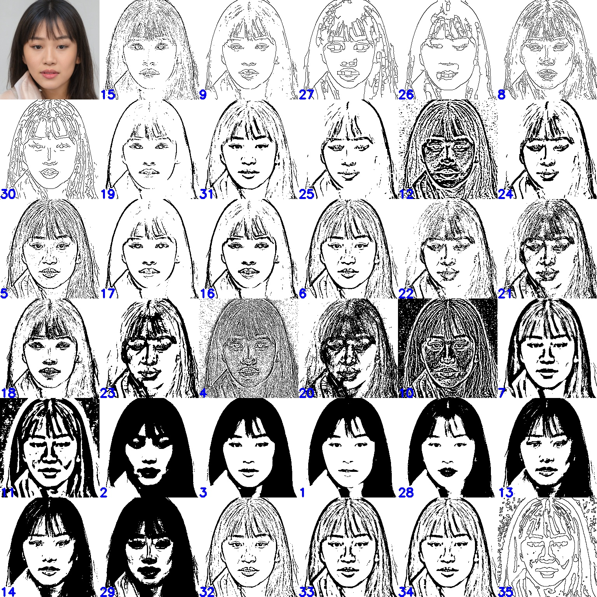

# 얼굴 만들기
</img>

 얼굴 만들기는 다음 4단계로 진행된다.
</img>
 

## 데이터셋 준비 (1단계)
1) 얼굴이미지 준비
 얼굴이미지는 generated photos에서 제공되는 데이터셋을 사용하며, 얻을 수 있는 방법은 두 가지이다.

    1) Bulk로 다운받은 데이터셋에서 정면얼굴 이미지만 골라서 사용
        + 다운받은 데이터셋은 MARS 구글 드라이브에 있다.
        + 이미지 사이즈는 1024 x 1024
    2) open API로 원하는 특징의 이미지만 골라서 사용
        + generated photos 사이트에서 회원가입 후, 발급받은 API key가 필요하다.
        + 한 달에 50번만 무료 호출이 가능하며, 한 번 호출할 때마다 100개까지 다운로드가 가능함
        + 이미지 사이즈는 512 x 512
        + download_generated_photos.py 코드에서 발급받은 API key 입력 후, 실행하면 이미지를 다운받을 수 있다.
        + 다만, 코드에서 API 호출 -> 이미지 다운로드를 반복하는데 중간에 통신이 끊겨서 제대로 된 응답을 받지 못하는 문제가 빈번하게 발생했다.
        + <pre><code>python download_generated_photos.py</code></pre>

2) 얼굴부위 이미지 준비
 1번에서 구한 얼굴이미지를 facial landmark를 활용하여 얼굴 부위 별로 크롭한다.
  <pre><code>python crop_features_main.py</code></pre>
얼굴 만들기 작업에서 부위 이미지를 원활하게 불러오기 위해서 부위명은 아래의 규칙을 반드시 지켜서 저장해야 한다.
    + 오른쪽/왼쪽 눈 : 원본이미지id_reye.jpg, 원본이미지id_leye.jpg
     (왼쪽, 오른쪽은 이미지의 인물 기준이다. 보는 사람 입장에서는 반대가 된다.)
    + 오른쪽/왼쪽 눈썹 : 원본이미지id_reyebrow.jpg, 원본이미지id_leyebrow.jpg
    + 코 : 원본이미지id_nose.jpg
    + 입 : 원본이미지id_mouth.jpg

3) 얼굴, 부위 이미지 선정
 얼굴을 만들 때, 사용할 이미지를 선정한다. 부위 이미지의 경우, 잘리거나 필요없는 영역이 나온 이미지는 제외하고 선정한다.

 

## 얼굴부위 조합 ~ 채색 데이터셋 만들기 (2~4단계)
얼굴부위 조합 ~ 채색을 위한 데이터셋 생성은 아래 코드만 실행하면 한 번에 수행 가능하다.
얼굴부위 조합을 위해 선정한 눈, 눈썹, 코, 입 이미지를 지정된 디렉토리에 넣어줘야 한다.
<pre><code>python make_dataset.py</code></pre>

 

## 채색모델 학습하기 (4단계)
1) px2pix (https://github.com/junyanz/pytorch-CycleGAN-and-pix2pix)
 6사 벤치컴의 stargan-v2 아나콘다 환경에서 512x512 사이즈의 이미지 학습이 가능하며, 학습 및 테스트 실행 코드는 다음과 같다. (하이퍼파라미터에 대한 설명은 pix2pix github 참고바람) 
    <pre><code>
    # 학습 실행 코드
    python train.py --dataroot ./dataset/asian --name asian --model pix2pix --netG unet_256 --direction AtoB --lambda_L1 100 
    --dataset_mode aligned --norm batch --pool_size 0 --preprocess none -- n_epochs 200 --n_epochs_decay 200
    
    # 테스트 실행 코드
    python test.py --dataroot ./dataset/asian --name asian --model pix2pix --direction AtoB --preprocess none --num_test 200
    </code></pre> 
    
    동양인 채색모델 생성 시 사용한 데이터셋 개수와 학습 실행코드는 다음과 같다.
    + 데이터셋
        + train : 900장 (동양인 정면얼굴 원본 512 x 512 / 남자 450장, 여자 450장)
        + val :  100장 (동양인 정면얼굴 원본 512 x 512 / 남자 50장, 여자 50장)
    + 학습 실행코드
        <pre><code>python train.py --dataroot ./face/asian --name asian --model pix2pix --netG unet_256 --direction AtoB --lambda_L1 100 --dataset_mode aligned --norm batch --pool_size 0 --preprocess none --n_epochs 100 --n_epochs_decay 100 --save_epoch_freq 50</code></pre>
    + 테스트 실행코드
        <pre><code>python test.py --dataroot ./face/asian --name asian --model pix2pix --direction AtoB --preprocess none --num_test 200</code></pre>

2) pix2pixHD
 pix2pixHD는 고화질 이미지 생성모델이기 때문에 고성능의 GPU가 필요하다. GCP나 AWS spot instance를 활용해 별도의 학습환경 구축을 진행해야 하며,
서양인 채색모델 학습 시 구축했던 환경은 다음과 같다.
    + OS : Ubuntu
    + GPU : Tesla V100
    + CPU : intel Xeon
    + RAM : 30GB

 

## 이진화 이미지 비교하기 (35가지 이진화 필터)
</img>

얼굴 형태를 가장 잘 드러내는 이진화 필터를 찾기 위해 머큐리 GUI 프로그램을 다운받아 사용하였고, 중첩된 필터를 적용하여 총 35가지 이진화 필터를 만들었다.
+ 이진화 필터를 찾는데 활용한 머큐리 프로젝트 사이트 : https://mercurypreprcs.com/
+ 홈페이지에서 GUI 프로그램을 다운받아 사용할 수 있다. (회원가입 후 API 키 발급 필요)

아래 코드를 사용하면 원본 이미지에 35가지 이진화 필터를 적용하여 한 눈에 비교하기 쉽도록 나타내준다.
<pre><code>python make_binaryface.py</code></pre>

35가지 이진화 필터 정보는 다음과 같다. (세부 파라미터 값은 코드 binary_filterlist.py 참고 바람)

| 필터id  | 카테고리 | 적용한 필터1 | 필터2 | 필터3 | 필터4 | 필터5 | 
| ----------| ---------- | ---------- | ---------- | ---------- |  ---------- | ---------- |
| 1 | Binarization | Threshold_binary | - | - | - | - | 
| 2 | Binarization | Threshold_binary | - | - | - | - | 
| 3 | Binarization | Threshold_otsu | - | - | - | - | 
| 4 | Binarization | Adaptive_threshold_gaussian_c | Threshold_binary_inverse | - | - | - | 
| 5 | Binarization | Adaptive_threshold_gaussian_c | - | - | - | - | 
| 6 | Binarization | Adaptive_threshold_gaussian_c | - | - | - | - | 
| 7 | Binarization | Adaptive_threshold_gaussian_c | - | - | - | - | 
| 8 | Edge Detection | Canny | Threshold_binary_inverse | - | - | - | 
| 9 | Edge Detection | Canny | Threshold_binary_inverse | - | - | - | 
| 10 | Edge Detection | Difference_of_gaussian | - | - | - | - | 
| 11 | Edge Detection | Difference_of_gaussian | Threshold_binary | - | - | - | 
| 12 | Edge Detection | Difference_of_gaussian | Threshold_binary_inverse | - | - | - | 
| 13 | Edge Detection | Emboss | Threshold_binary_inverse | - | - | - | 
| 14 | Edge Detection | Emboss | Threshold_otsu | - | - | - | 
| 15 | Edge Detection | High pass | Threshold_binary_inverse | - | - | - | 
| 16 | Edge Detection | Prewitt | Threshold_binary_inverse | - | - | - | 
| 17 | Edge Detection | Prewitt | Threshold_otsu | Threshold_binary_inverse | - | - |  
| 18 | Edge Detection | Roberts | Threshold_binary_inverse | - | - | - | 
| 19 | Edge Detection | Roberts | Threshold_binary_inverse | - | - | - | 
| 20 | Edge Detection | Scharr | Threshold_binary_inverse | - | - | - | 
| 21 | Edge Detection | Scharr | Threshold_binary_inverse | - | - | - | 
| 22 | Edge Detection | Scharr | Threshold_binary_inverse | - | - | - | 
| 23 | Edge Detection | Sobel | Threshold_binary_inverse | - | - | - | 
| 24 | Edge Detection | Sobel | Threshold_binary_inverse | - | - | - | 
| 25 | Edge Detection | Sobel | Threshold_binary_inverse | - | - | - | 
| 26 | Morphology | Dilation | Canny | Threshold_binary_inverse | - | - | 
| 27 | Morphology | Erosion | Canny | Threshold_binary_inverse | - | - | 
| 28 | Sharpening | MSRCP | Threshold_binary | - | - | - | 
| 29 | Cartoon | Cartoon | Threshold_binary | - | - | - | 
| 30 | Sharpening | MSRCP | Median | Median | Canny | Threshold_binary_inverse |
| 31 | Smoothing | bilateralFilter | gaussian_filter | dodge | Canny | - | 
| 32 | Binarization | Adaptive_threshold_mean_c | - | - | - | - | 
| 33 | Binarization | Adaptive_threshold_mean_c | - | - | - | - | 
| 34 | Binarization | Adaptive_threshold_mean_c | - | - | - | - | 
| 35 | Smoothing | Difference_of_gaussian | Adaptive_threshold_mean_c | - | - | - | 

